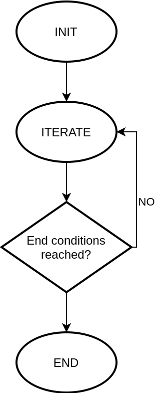
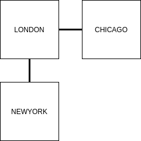
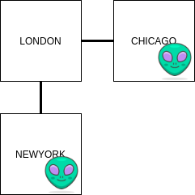
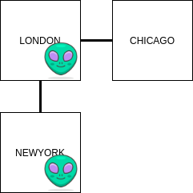
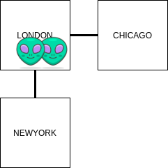
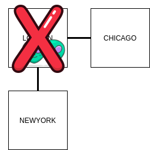
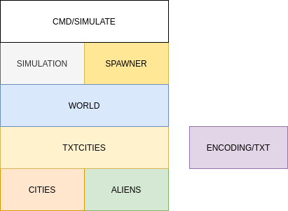

# Alien invasion

Simulating an alien invasion of planet X.

## Domain

### Cities

The Planet X is composed by many cities.

Each city can be linked to other cities via roads.

A road links two cities bidirectionally, that means that if a road from city A
to city B exists, it can also be used for going from city B to city A.

A city can have zero to four roads, one for each _direction_ (north, south,
east, west).

If a city has zero roads, it is _destroyed_ and no one can travel to/from it.
For the purpose of this simulation it's the same as this city doesn't exist at
all.

### Aliens

Aliens are invading the planet. At the beginning of the simulation, aliens spawn
in random cities.

The simulation is composed by _steps_. At each step, every alien can move to a
nearby city by following one of the existing roads, or it may decide to not move
at all.

When two aliens ends up in the same city, they destroy each other.
The city is also _destroyed_, together with every road linked to it.

## Simulation

The simulations itself can be represented in just three stages:

<p align="center">
	
</p>

### Init stage

- create cities
- spawn aliens

### Iteration stage

Each iteration consists of:

- aliens move or stay in their current city
- if two aliens are in the same city, they are destroyed together with the city
- if an _end condition_ is reached, move to the _End stage_.

### End conditions

The simulation goes from the _Iteration stage_ to the _End stage_ when at least
one of the following conditions is satisfied:

- there are no aliens left (they all destroyed each other)
- aliens can't no longer move (they are trapped in cities with no roads, etc.)
- each aliens has moved at least 10.000 times

### End stage

- output the state of the world

### Example

An example of a simulation with three cities.

<p align="center">
	
</p>

Two aliens spawns.

<p align="center">
	
</p>

After the first iteration, one of the aliens decide to remain in _NEWYORK_. The other moves from _CHICAGO_ to _LONDON_.

<p align="center">
	
</p>

After the second iteration, the first alien moves from _NEWYORK_ to _LONDON_, while the second alien decides to remain in _LONDON_.

<p align="center">
	
</p>

Since two aliens are in the same city, they fight destroying each other and disconnecting the cities.

<p align="center">
	
</p>

Since _CHICAGO_ and _NEWYORK_ had no other roads, they are disconnected too. The output world of the simulations is empty.

# Implementation

This Go program reads the world map from a text file that contains a list of
cities and roads (see Input section below for the format of this file).

The simulations begins with spawning N aliens. The number N can be specified
through command line arguments (see _Usage_ section below).

## Input map

The program reads a text file in the following format:

```
Foo north=Bar west=Baz south=Qu-ux
Bar south=Foo west=Bee
Bee east=Bar
Qu-ux north=Foo
```

### Caveats

It is assumed that every city has a unique name, this name can contain any UTF-8
character except for spaces (` `) and equals (`=`).

A single line of the file cannot exceed 64KB.

The parser assumes that for each connection from one city to another, also the
other direction is specified in another line. For example this file is not
considered valid:

```
A north=B
```

While this should be the correct version:

```
A north=B
B south=A
```

## Packages

<p align="center">
	
</p>

I tried to decouple packages as more as possible.

From the bottom: packages `cities` and `aliens` are the basic entities of this
program. The first includes `City` and its corresponding `Repository`, while
`aliens` actually depends on `cities` for their moves.

As a side package there's `encoding/txt`. It's the package including some logic
for (de)serializing types into `[]byte`. It doesn't have dependencies on the
other packages.

`txtcities` implements wrappers for making `cities` support `encoding/txt`. This
will be used for serializing and deserializing the world map into the text file.
This way, if the format of the input/output file changes, the `cities` package
should not be changed.

The actual business logic can be found in the upper packages:

- `world` glues together the cities repository with the aliens tracker and
  repository, providing some higher level methods to the above packages
- `spawner` implements the logic to add new aliens to the world
- `simulation`, the true logic of the simulation is here. It takes a world and
  runs the iterations, destroying cities and dispatching events when this happen

Finally, `cmd/simulate` is the main entry point of the go program and prepares a
new simulation accordingly to the provided configuration.

## Usage

```sh
$ go run ./cmd/simulate -aliencount 2
```

the most basic usage, it will use the provided `./sample.txt` file as the world
map.

More options can be found using:

```sh
$ go run ./cmd/simulate -help
Usage of /tmp/go-build8868487/b001/exe/simulate:
  -aliencount int
        number of aliens to spawn (default 10)
  -alienmoves int
        maximum number of times an alien can move (default 10000)
  -aliensdestroycity int
        number of aliens required to destroy a city (default 2)
  -path string
        filepath containing the map (default "./sample.txt")
```

## Complexity

Considered a world with `C` cities, parsing the input map file is linearly
complex both in time and space () since every city has a constant number of neighbors (0-4).

Given a world with `A` aliens, each iteration cost is linearly complex both in
time and space with the number of aliens
()
since every alien have to make their move, but can only move once per iteration.

The exact number of required iterations it's not possible to compute in advance.
It can also be infinite with some combinations of aliens' moving policy and map
structure.
If we assume that an alien must always move, then the number of iterations becomes constant 
since it's limited to 10.000 by default.

The probability that an alien moves is related to the number of neighbors of its
city:

- 4 neighbors -> 1/5 percentage of times it doesn't move
- 3 neighbors -> 1/4 percentage of times it doesn't move
- 2 neighbors -> 1/3 percentage of times it doesn't move
- 1 neighbors -> 1/2 percentage of times it doesn't move

In the worst case, the alien chose to move half of the times, so the expected
number of iterations required in the worst case is 2 \* 10.000 = 20.000. As
before, we consider this a

complexity.

The total time cost of the simulation is therefore
.

## Going further

I left open the possibility to implement new policies for the alien to decide if
and how to move. Also, the policy of the spawner for choosing where to add new
aliens at the beginning can be replaced.
